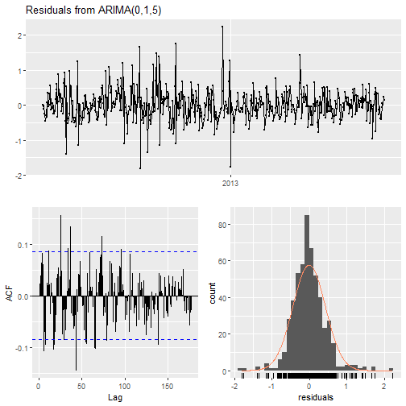

ARIMA Examples
========================================================
author: 
date: 
autosize: true


Non-Seasonal ARIMA: Dataset
========================================================

This dataset is collected from a monitor system mounted in a house. It corresponds to approximately 40 days of monitoring data. 

- Attribute: Monitored wind speed
- Time period: 40 days
- Source: UCI Machine Learning Respository
- Modifications: Mean wind speed grouped by hour


Non-Seasonal ARIMA: Plot
========================================================


Looking at the time series plot, the following can be observed:

- There does not appear to be any seasonality or trends in the dataset
- The data are not stationary, there are sharp peaks and dips
- The variance appears to be constant throughout the time series


Non-Seasonal ARIMA Example: Auto Arima
========================================================

Let's try applying auto arima to the wind speed time series and taking a look at residuals.

* The ACF plot shows residuals outside normal threshold limits
* The portmanteau test returns a very low p-value

Both of these indictors show these is still autocorrelation present in the time series.


```r
fit <- auto.arima(wind, seasonal = FALSE)
checkresiduals(fit)
```



```

	Ljung-Box test

data:  Residuals from ARIMA(0,1,5)
Q* = 209.98, df = 101, p-value = 1.225e-09

Model df: 5.   Total lags used: 106
```

Non-Seasonal ARIMA Example: ACF and PACF
========================================================

The ACF and PACF lag plots show the following:

- Autocorrelation throughout the ACF plot (adjust autoregressive part)
- Autocorrelation at lag = 1 and lag = 2 in the PACF plot


```r
ggtsdisplay(wind)
```


Non-Seasonal ARIMA Example: Manual Arima
========================================================

The previous model was not sufficient because there was autocorrelation. To resolve this, the order of the autoregressive part has been increased to 5.


```r
fit <- Arima(wind, order = c(5, 0, 5))
checkresiduals(fit)
```


```

	Ljung-Box test

data:  Residuals from ARIMA(5,0,5) with non-zero mean
Q* = 100.32, df = 95, p-value = 0.3346

Model df: 11.   Total lags used: 106
```


Non-Seasonal ARIMA Example: Forecast
========================================================

Let's forecast average hourly wind speed for the next two days:


```r
autoplot(wind) + autolayer(forecast(fit, h = 48))
```


Seasonal ARIMA Example: Dataset
========================================================

This dataset contains measurements of electric power consumption in one household with a one-minute sampling rate over a period of almost 4 years. 

- Attribute: Global_active_power
- Time period: 4 years (data every minute)
- Source: UCI Machine Learning Respository
- Modifications: Mean Global_active_power grouped by week


Seasonal ARIMA Example: Plot
========================================================


The following plot shows:
* Original consumption time series
* Season adjusted time series
* BoxCox transformation time series
* BoxCox transformation then season adjusted time series


```r
adj_consumption <- consumption %>% stl(s.window = "periodic") %>% seasadj()
bc_consumption <- BoxCox(consumption, BoxCox.lambda(adj_consumption))
bc_adj_consumption <- bc_consumption %>% stl(s.window = "periodic") %>% seasadj()
autoplot(consumption) + autolayer(adj_consumption) + autolayer(bc_consumption) + autolayer(bc_adj_consumption)
```


Seasonal ARIMA Example: Auto Arima
========================================================

Let's try applying auto arima to the consumption time series and taking a look at residuals.

* The ACF plot shows residuals inside normal threshold limits
* The portmanteau test returns a very high p-value

Both of these indictors show that there is no autocorrelation present in the time series.


```r
fit <- auto.arima(bc_adj_consumption, seasonal = TRUE)
checkresiduals(fit)
```


```

	Ljung-Box test

data:  Residuals from ARIMA(0,0,2)(1,0,0)[52] with non-zero mean
Q* = 32.557, df = 38, p-value = 0.7189

Model df: 4.   Total lags used: 42
```

Seasonal ARIMA Example: Forecast
========================================================

Let's forecast average weekly consumption for the next 52 weeks:


```r
autoplot(bc_adj_consumption) + autolayer(forecast(fit, h = 52))
```


